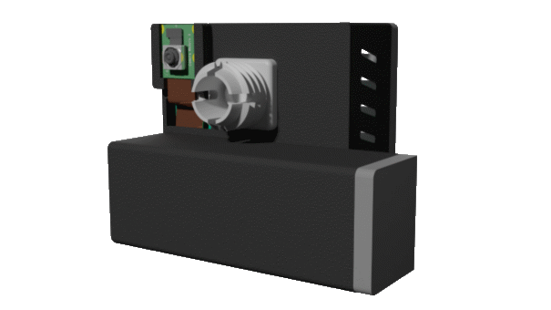
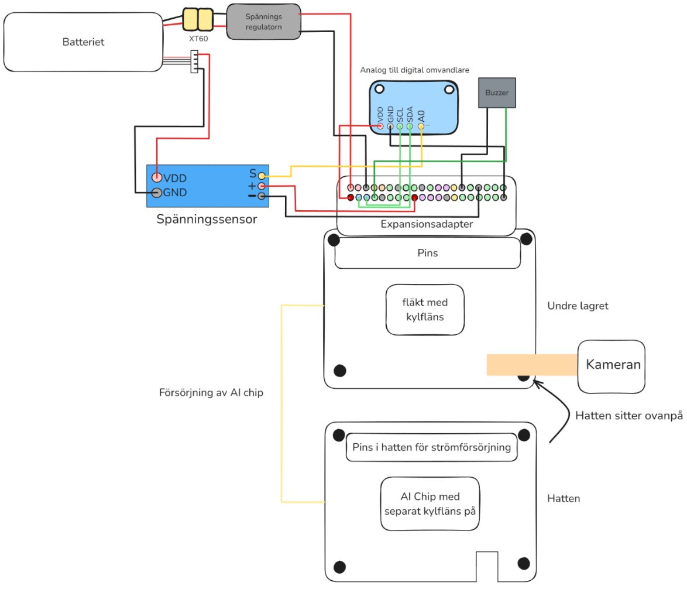
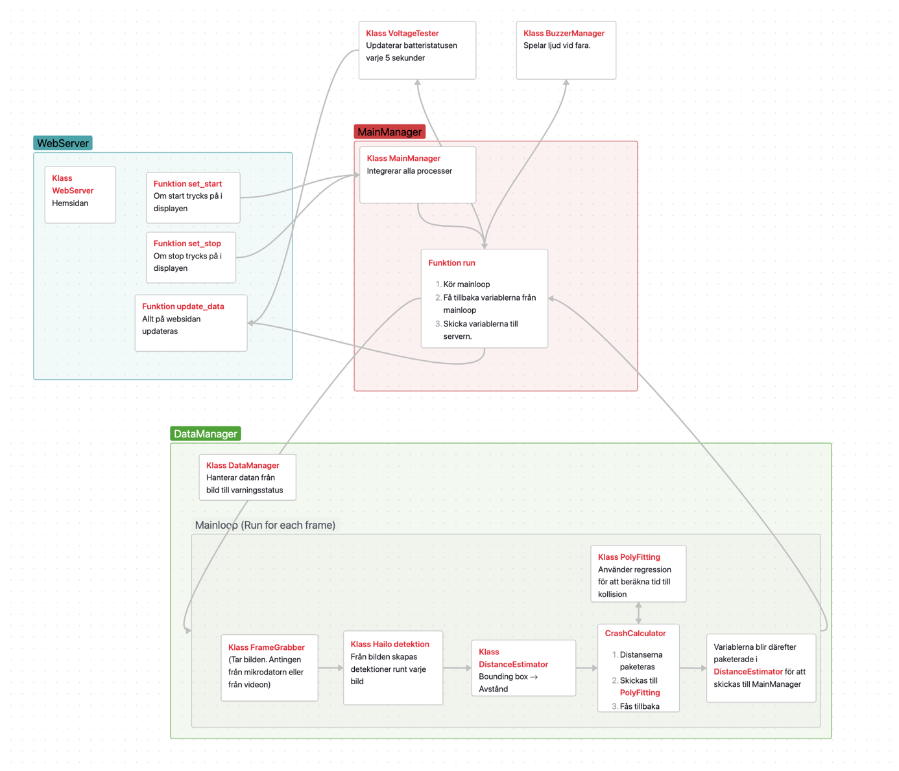

### **PiVision – Mobilt Förarstödssystem**

#### _Gymnasiearbete av Gustav Gamstedt & Liam Thorsén_

---

## **Beskrivning**

PiVision är ett kostnadseffektivt och hållbart mobilt förarstödssystem utvecklat för att öka trafiksäkerheten i äldre fordon. Systemet använder en **Raspberry Pi** med **AI-baserad bildbehandling** (YOLOv10n) för att:

- Upptäcka närliggande fordon i realtid (~20 bilder/sekund).
- Beräkna avstånd och kollisionsrisk med matematiska modeller.
- Varna föraren via ett **webbgränssnitt** (visas på mobil) och **summer**.
    
Projektet adresserar bristen på moderna säkerhetsfunktioner (t.ex. kollisionsvarning) i äldre bilar.

---

## **Teknisk Översikt**

### **Hårdvara**
- **Raspberry Pi 5** med **Hailo AI-accelereringskort** (för snabb bildanalys).
- **Kamera** (monterad på vindrutan via 3D-printad hållare).
- **Batterisystem** (3-cells 2200 mAh med spänningsregulator).
- **Sensorer**: Spänningsmätning, summer för varningar    
- **3D-printade komponenter**: Hållare, batterifack, vindrutefäste.
    

### **Mjukvara**
- **Python** med bibliotek:
    - `picamera2` (bildhantering).
    - `supervision` (datorseende).
    - `NumPy` (avståndsberäkningar).
    - `threading` (multitasking).
        
- **Webbgränssnitt**: Byggt med hjälp av ChatGPT/Claude AI.
- **AI-modell**: YOLOv10n (anpassad för bil-, lastbil- och bussdetektering).
    

---

## **Installation & Användning**

1. **Montering**:
    - Fäst 3D-printad hållare på vindrutan med bifogat vindrutefäste.
    - Anslut kameran, batteriet och övriga komponenter enligt elkonstruktionsdiagrammet.
        
    
2. **Webbgränssnitt**:
    - Anslut till Raspberry Pi:s nätverk och öppna webbadressen i en webbläsare.
        

---

## **Funktioner**

- **Realtidsdetektering**: Visar avstånd till närmaste fordon (framåt/sidled).
- **Varningssystem**:
    - 9-stegs trafikljus (grön → orange → röd) baserat på kollisionsrisk.
    - Summer vid hög risk.
- **Batteriövervakning**: Visar laddningsnivå på webbgränssnittet.

---

## Rapport
[Se rapport](ReadMe_files/PiVision_gyarb_rapport.pdf)

Se rapporten för fler illustrationer och förklaringar.

---

## **Kostnad & Hållbarhet**
- **Total kostnad**: ~2633 SEK (billigare än att köpa en ny bil!).
- **Miljöpåverkan**: Minskar behovet av nybilstillverkning (sparar ~11-14 ton CO₂ per bil).
    

---

## **Framtida Utveckling**
- Stöd för fler kameror (t.ex. döda vinkeln).
- Körfältsdetektering och fotgängarvarning.
- Optimering av AI-modellen för snötäckta fordon.
    

---

## **Referenser & Tack**

- **Handledare**: Pär Henriksson (Hitachigymnasiet), Agustin Corbat (Uppsala universitet).
- **Källor**: Hailo AI, Raspberry Pi, Python-bibliotek. Se fullständig referenslista i rapporten.
    

---

## **Licens**

MIT License – Fritt att använda och modifiera för icke-kommersiellt bruk.    
